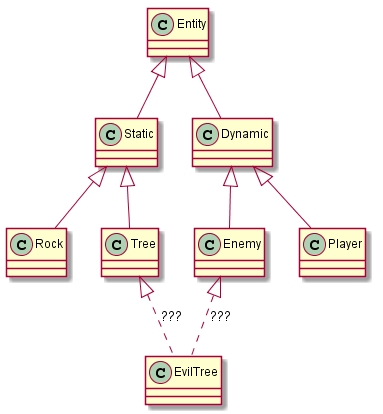
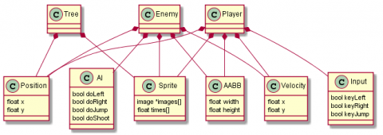

# Scripting
This is a short overview of how scripting inside QICI Engine works.  
Scripting inside QICI Engine consists of attaching custom script objects called behaviours to game objects (nodes). Different functions inside the scripts objects are called on certain events. The most used ones being the following:  
  **awake**: This function is called when the object is instantiated.  
  **update**: This function is called before rendering a frame. This is where most game behaviour code goes.  

## Thinking With Components
While QICI Engine is an amazing gamedev platform, getting used to it will require a bit of initial work, as you'll likely need to shift your cognitive cogs to grasp its component-based architecture.  

While classic Object Oriented Programming (OOP)  can be, and is, used, The QICI Engine workflow highly builds around the structure of components - which requires component-based thinking. If you're familiar with components, that's great; if not, that's not a problem. Here, I'll give you a crash course on components in QICI Engine.  

### What Is a Component?
Before we proceed with how to work and think with components, let's make sure we fully understand what exactly they are.  

In the world of programming, the concepts of components and decoupling go hand in hand. A component can be thought of as a smaller piece of a larger machine. Each component has its own specific job and can generally (and optimally) accomplish its task or purpose without the help of any outside sources. Additionally, components rerely belong to a single machine, and can be joined with various systems to accomplish their specilfic task, but achieve different results when it comes to the bigger picture. This is because components not only don't care about that bigger picture, but also don't even know it exists.  

A classic example of components are the pieces of a car — but that's boring, as I'm not too into cars. Instead, consider an Xbox 360 controller. It has two analog sticks, various buttons, triggers, and so on. Not only is the entire controller itself a component, but each individual aspect of the controller is a component.  

The X button can: be pressed; send off the information that it's been pressed; be released; and send off information that's it's been released. It has no idea there are various other buttons right next to it, nor does it care.  

The controller itself is a component, composed of other components (all of the buttons, joysticks, and triggers), because it can send data to whatever it's plugged into, but it doesn't care what that object is (Xbox, PC, some Arduino creation, or whatever). Neither the X button, nor the controller itself, needs to know what game you're playing, as it'll still do its job regardless of the receiver of its information.   

The function of the controller is a one-way street, and its task will never change due to what it's plugged in to. This makes it a successful component, both because it can do its job as a standalone device, but also because it can do its job with multiple devices.  

### How and Why Does QICI Engine Favor Components?
QICI Engine was build with components in mind, and it shows. One of the most valuable and distinctive aspects of QICI Engine is that it's a very visual program. I've been working in game development for years now, and I've mostly worked with PNG sprite sheets and a code editor isn't visual at all.  

QICI Engine is the exact opposite. QICI Engine lets you see everything you're working on, and in real time. This means you can test you project, see your project running in a separate window, make edits to your code or game objects, and see those edits reflected live. The amount of power this system gives to a developer is immense, and is now, in my opinion, an essential aspect of modern game development. All of this is made possible by QICI Engine's compnent-based architecture.  

### The Inspector
As Chapter.1 said, if you click on your player (or node, gameobject) in the world (either at run-time, or before) you'll be able to see everything about that object. If your player avatar has six components on them, each will be listed in a separate tab, and every serializable variable (public variable) will be available for you to see, and tweak. If your player avatar has an inventory, you'll not only see that he has an inventory, you'll also be able to see the items in that inventory, and which index in the list or array each particular item occupies. If you pick up a new item in-game while you're testing, you'll see it added to the inventory—live. You can even add or remove items from that inventory, which would allow you to quickly test new items, which you could even be creating while the game runs.  

While live editing is insanely powerful, it's not exactly reliant on the use of components. You could change a script, and see those edits reflected live, but that's limiting compared to what components allow you to do.  

Consider a vertical space shooter. When you test your project in most other environments, you'll see how your game plays, take notes, then go back into the code and tweak things, only to compile the project again and test those points. If you have a live setup, you can tweak that code on the fly, and see those changes while you play, which is even better. That being said, if you're not using components, you're going to have to change a lot of code to see any major effects, which takes time, and this rather defeats the purpose of live editing.  

If you are working with components, you can add new components in two seconds flat. You can swap out your ship's guns for the guns a boss uses (assuming you programmed your components to function on their own, as good components should do), you can change your five-hit health system to that cool Halo-like recharge shield you programmed for another game. you can add an array of spells to one of your characters, and all in seconds.  

You don't need to change any code, you don't need to recompile, you simply drag and drop, or select your desired component from a drop-down list, and it's added. That kind of power is invaluable to game balancing, and it saves tremendous amounts of time.  

### Switching to Component-Based Thinking
The hardest part about working with components is learning how to structure your projects when using them. For most programmers, this will likely mean that you'll be creating a lot more scripts, with each doing smaller, more specific tasks.  

How you communicate between scripts is also a decent hurdle, as you'll have a lot more pieces and fewer giant classes where every object knows about every other object. There are obviously ways around this, such as static variables for core components of your game (players, score, and so on), but that rarely works for everything (and is not advised), and there are advanced methods to properly structure your components, and to stay decoupled.  

Fortunately, since QICI Engine was built with components in mind, it has a number of built-in functions that help us achieve this. There are functions to get references to a specific component, to check all objects to see which contain a specific component, etc. With these various functions, you can easily retrieve the information needed to create that magical one-way street of knowledge where components can communicate with objects they affect, but the component itself has no idea what exactly that object is. Combine this with the use of interfaces, and you've got enough programming power to take any approach to the matter, simple or complex.  

### OOP vs Component-Based
The traditional way to implement game entities was to use object-oriented programming. Each entity was an object, which intuitively allowed for an instantiation system based on classes and enabled entities to extend others through polymorphism. This led to large, rigid class hierarchies. As the number of entities grew, it became increasingly difficult to place a new entity in the hierarchy, especially if the entity needed a lot of different types of functionality. Here, you can see a simple class hierarchy. A static enemy does not fit well into the tree.  
    
  **Figure 2-1.**  

To solve this, game programmers started to build entities through composition instead of inheritance. An entity is simply an aggregation (technically a composition) of components. This has some major benefits over the object-oriented architecture described above:  
It's easy to add new, complex entities  
It's easy to define new entities in data  
It's more efficient  

Here's how a few of the entities above would be implemented. Notice that the components are all pure data - no methods. This will be explained in detail below.  
    
  **Figure 2-2**  

### Example: Enemy Types
In an OOP inheritance system, you could have a base **Enemy** class that contained any and all functions that most of your enemies would use, and then you could extend that to add specific functionality.  

If you've ever actually implemented such a system, you're aware that between your base **Enemy** class, and perhaps your base **Node** (or equivalent: GameObject) class, you end up with a lot of unneeded clutter from having variables and functions that some classes need, but many don't. Interfaces can help with this, but they're not always the solution.  

Now, let's take a look at the same setup, but thinking with components. You still have various enemies, all of which share a lot of common functionality, but each of which has unique characteristics.  

The first step is to break all functionality into pieces. One might think that having health and dying are part of the same system, but even that example can be broken up into a health system component, and a death system component. This is because your health is your health, and nothing more. When it reaches zero, it's not up to the health system to decide what happens next, it's only up to the health system to know that it is, in fact, at zero. Other systems, such a death system, can read this information, and then choose to do as they please.  

Maybe the death system will spawn a new enemy (think of a large enemy breaking into bits); maybe it'll drop a power-up; maybe it'll add an explosion effect to the screen. Regardless of what happens, the health system isn't a part of that, and this is how we make clean and useful components.  

When we think of movement, we might think that all movement needs to be in a single script. But some enemies in some games can't walk; they can only jump. Some enemies can walk, but can't jump. Thinking about these things is how we spot where components could, and should exist. When it comes to mobility, we could separate the jump from walking or running, separate flying, and so on — doing so will give us cleaner code, and more versatility.

Components make our code neater (no unnecessary variables and functions), but they also make the process of creating enemies far more flexible and enjoyable. With each piece of enemy functionality set up as a component, we can drag and drop aspects of enemies, and see how they behave — and even in real time, if we're using QICI Engine.   

Let's assume all of the following characteristics are already programmed. During our enemy creation process, we could create three blank enemies, which are all just empty prefabs in QICI Engine. We can then drag on a health system, an item drop system, and a death system, as we know that all of our enemies, regardless of differences, will have health, die, and drop an item. We can actually select all three prefabs at once, then drag and drop these components into the Inspector panel, and update all three at the same time.  

Next, we know that one enemy will be able to fly, so we select that one enemy, and drag a flying component onto it. Another can spot a target in the game, and fire at it, so we toss on a fire at target component script. The third can throw up a barrier that blocks all attacks for a short duration, so we toss on the barrier component.  

We now have three unique enemies, all sharing certain components, but all also having components that apply just to them. The enjoyable part is that making these enemies is simple, and experimenting with new variations is as easy as dragging and dropping. Want a flying enemy, with a barrier, that can target an enemy and fire at it? Drag all the above components onto a single enemy, and you've got just that!   

You will get a real feel for it with seeing some codes in the upcoming content.

## Define a Component （完善中）
Let's do some preparation:  
1. Create a new project
2. Download the [textue](images/enemy.png), and import it to the folder: 'Assets/texture'
3. Create a Sprite by click the menu 'GameObject/Sprite'. Rename the object to 'enemy' (Select the newly created node, right-click -> Rename and then type 'enemy')
4. Drag the texture imported at step 2 to the Sprite  

Next, let's create a new javascript file. In the Project view, right-click on folder 'Scripts', type 'Health', and press Enter. Double-click on the script and type the following code:  
```javascript
	TODO
``` 

## Attach the Component to Node
TODO

